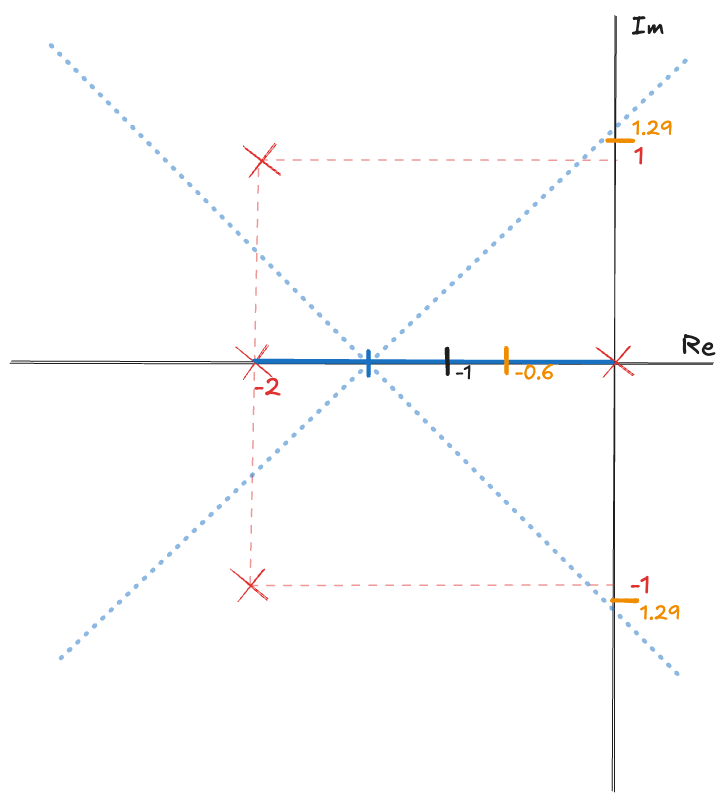

# Root Locus Plt 📈

Python tool for plotting the Root Locus (LGR) of control systems given their open-loop transfer functions $G(s)$ and $H(s)$.

## 🚀 Usage Example

Consider a high-performance missile 💥 designed for satellite launch, which operates under a unity feedback system characterized by the following transfer function:

$$
G(s) = \frac{K}{s(s+2)(s^2 + 4s + 5)}
$$

To plot the Root Locus for this system, we need to determine the dominant poles when $K = 6.5$:

$$
s = -0.35 \pm j0.80
$$

### Solution

The characteristic equation can be expressed as:

$$
1 + G(s)H(s) = 1 + KP(s) = 0
$$

where:

$$
KP(s) = K\frac{1}{s(s+2)(s^2 + 4s + 5)} \implies P(s) = \frac{1}{s(s+2)(s^2 + 4s + 5)}
$$

Factoring the polynomial $P(s)$ gives us the poles and zeros:

- **Poles:** $\{(0, 0), (-2, 0), (-2 + j1), (-2 - j1)\}$
- **Zeros:** $\emptyset$

From this information, we can mark the poles and zeros of the open-loop system in the $s$-plane and identify the segments along the real axis that are part of the Root Locus.


The number of separate loci can be determined by:

$$
LS = n_p, \text{ when } n_p \geq n_z
$$

Where:
- $n_p = \text{Number of finite poles}$
- $n_z = \text{Number of finite zeros}$

Thus,

$$
LS = n_p = 4
$$

The Root Locus is symmetric with respect to the real axis. Observing the previous sketch, we can see that the segment above the real axis is a mirror image of that below.

The $(n_p - n_z)$ segments of the Root Locus approach the zeros at infinity along asymptotes centered at $\sigma_A$ (the centroid) with angles $\phi_A$:

$$
\sigma_A = \frac{\sum (-p_j) - \sum (z_i)}{n_p - n_z}
$$

and

$$
\phi_A = \frac{(2q + 1)}{n_p - n_z} \cdot 180^\circ, \quad q = 0, 1, 2, \dots, (n_p - n_z - 1)
$$

Calculating these values yields:

$$
\sigma_A = \frac{[0 + (-2) + (-2 + j) + (-2 - j)]}{4 - 0} = \frac{-6}{4} = -\frac{3}{2} \approx -1.5
$$

The angles of the asymptotes are calculated as follows:

- For $q = 0$:

$$
\phi_0 = \frac{(2 \cdot 0 + 1)}{4} \cdot 180^\circ = 45^\circ
$$

- For $q = 1$:

$$
\phi_1 = \frac{(2 \cdot 1 + 1)}{4} \cdot 180^\circ = 135^\circ
$$

- For $q = 2$:

$$
\phi_2 = \frac{(2 \cdot 2 + 1)}{4} \cdot 180^\circ = 225^\circ
$$

- For $q = 3$:

$$
\phi_3 = \frac{(2 \cdot 3 + 1)}{4} \cdot 180^\circ = 315^\circ
$$

Now we can refine our sketch by plotting the asymptotes and their corresponding angles.


Next, we determine the points where poles intersect the real axis, if any. To find these points, we set the derivative $\frac{dp(s)}{ds} = 0$ for $p(s) = -P(s)^{-1}$:

$$
p(s) = -\left[\frac{1}{s(s+2)(s^2 + 4s + 5)}\right]^{-1} = -[s(s+2)(s^2 + 4s + 5)]
$$

Expanding this gives us:

$$
p(s) = (s^2 + 2s)(s^2 + 4s + 5) = s^4 + 6s^3 + 13s^2 + 10s
$$

Taking the derivative:

$$
\frac{dp(s)}{ds} = 4s^3 + 18s^2 + 26s + 10
$$

We find the roots of the equation:

$$
4s^3 + 18s^2 + 26s + 10 = 0
$$

The roots are:

$$
s = \{-0.60184, -1.9491 - j0.59584, -1.9491 + j0.59584\}
$$

We consider only the real root:

$$
s = -0.60184
$$


Now, we need to determine the points where the imaginary axis is crossed, if any. We apply the Routh-Hurwitz criterion on $G_{mf}(s)$:

$$
G_{mf}(s) = \frac{G(s)H(s)}{1 + G(s)H(s)} = \frac{\frac{K}{s(s+2)(s^2 + 4s + 5)}}{1 + \frac{K}{s(s+2)(s^2 + 4s + 5)}}
$$

Simplifying leads to:

$$
G_{mf}(s) = \frac{K}{s(s+2)(s^2 + 4s + 5) + K}
$$

Now, we check stability using the [Routh-Hurwitz](https://en.wikipedia.org/wiki/Routh%E2%80%93Hurwitz_stability_criterion) criterion on the characteristic polynomial $s^4 + 6s^3 + 13s^2 + 10s + K$:

$$
\begin{array}{|c|c|c|c|}
s^4 & 1 & 13 & K \\
s^3 & 6 & 10 &   \\
s^2 & a &  K &   \\
s^1 & b &    &   \\
s^0 & K &    &   \\
\end{array}
$$

Calculating the intermediate coefficients gives:

- For $a$:

$$
a = \frac{6 \cdot 13 - 10 \cdot 6}{6} = 11.33
$$

- For $b$:

$$
b = \frac{a \cdot 10 - K \cdot 6}{a} = \frac{11.33 \cdot 10 - K \cdot 6}{11.33}
$$

For the system to be critically stable (or unstable), we set $b = 0$:

$$
\frac{11.33 \cdot 10 - K \cdot 6}{11.33} = 0 \implies K = 18.8
$$

Applying this value of $K$ in the previous line yields:

$$
11.33s^2 + 18.8 = 0
$$

Solving for $s$:

$$
s^2 = \frac{-18.8}{11.33} \implies s = \pm j1.29
$$

These points indicate where the system crosses the imaginary axis.



With all points determined, we can use the angle condition to find the departure angle $[180° - (\sum \theta_i) + (\sum \phi_i)]$ for the complex poles and the arrival angle for the complex zeros. Here, $\theta_i$ are the angles from other poles to the pole in question and $\phi_i$ from zeros.

Noting the symmetry, we calculate:

- For $P(-2,1)$:

$$
∠P(-2,1)=180°-[90°+90°+(180°-\tan^{-1}\left(\frac{1}{2}\right))]=153.43°
$$

This gives us:

$$
\begin{matrix}
P(0,0) &= 180° \\
P(-2,0) &= 0° \\
P(-2,1) &= 153.43° \\
P(-2,-1) &= 206.56°
\end{matrix}
$$

Consequently, the sketch of the Root Locus appears as follows:


To validate our sketch, we can utilize software for plotting, such as the

 [LGR - Desmos](https://www.desmos.com/calculator/metxasgjcx) version created by the talented [@Lucas-Morais-Freire](https://github.com/Lucas-Morais-Freire):


Alternatively, we can use our simple Python tool available in this repository to generate the plot. Executing the code will yield the following output:

```bash
python ./main.py
# Poles of the open-loop system: [-2.+1.j -2.-1.j -2.+0.j  0.+0.j]
# Zeros of the open-loop system: []

# Root Locus Analysis:
# Number of poles: 4
# Number of zeros: 0
# Pole angles (in degrees): [ 153.43494882 -153.43494882  180.            0.        ]
```


To conclude, when $K=0$, the dominant pole is at the origin $P(0,0)$. However, for $K=6.5$, we obtain:

$$
G_{mf} = \frac{K}{s^4 + 6s^3 + 13s^2 + 10s + K}
$$

Leading to:

$$
s^4 + 6s^3 + 13s^2 + 10s + 6.5 = 0
$$

This results in:

$$
s = \begin{bmatrix}
-2.65069 - j1.22826 \\
-2.65069 + j1.22826 \\
-0.349307 - j0.799733 \\
-0.349307 + j0.799733
\end{bmatrix}
$$

Adding these points to the Root Locus results in the following plot:


The dominant poles for $K=6.5$ are, therefore, the ones closest to the imaginary axis:

$$
s = \begin{bmatrix}
-0.349307 - j0.799733 \\
-0.349307 + j0.799733
\end{bmatrix}.
$$

These dominant poles significantly influence the system's dynamics since they are nearest to the imaginary axis.

## 🏃🏼‍♂️ Run

To execute the script, use the following command:

```python
python ./main.py
```

### 💡 With VENV

To run the project in a virtual environment:

```bash
python3 -m venv venv
# deactivate # -> if necessary
source venv/bin/activate
pip install -r requirements.txt
python ./main.py
```

## 🔄 Update requirements.txt

To update the `requirements.txt` file with the current dependencies, run:

```bash
: > requirements.txt && pip freeze > requirements.txt
```